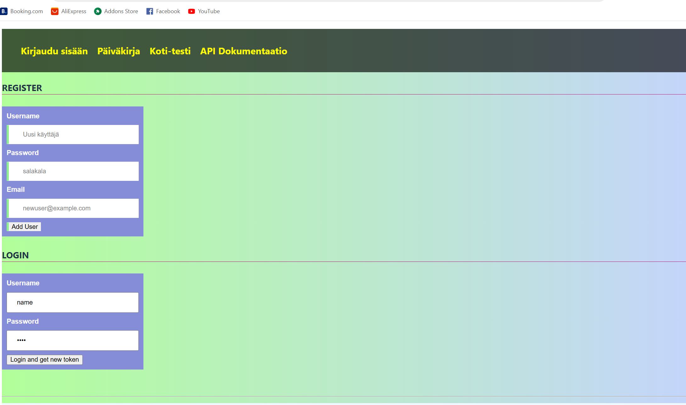
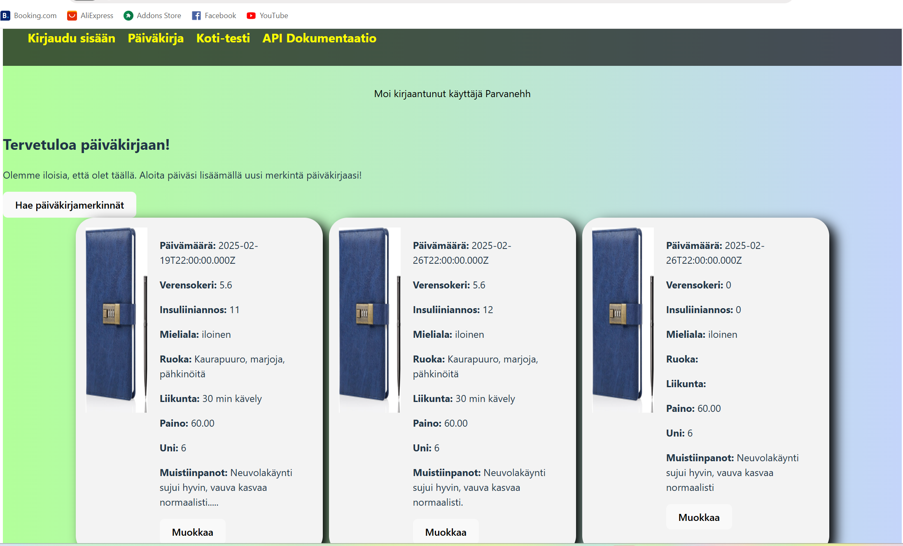
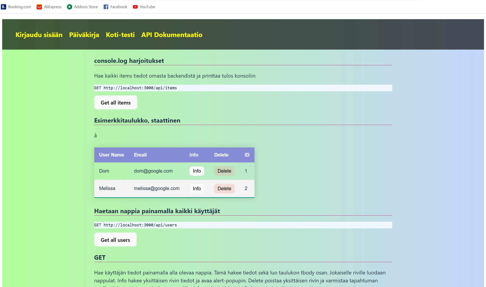
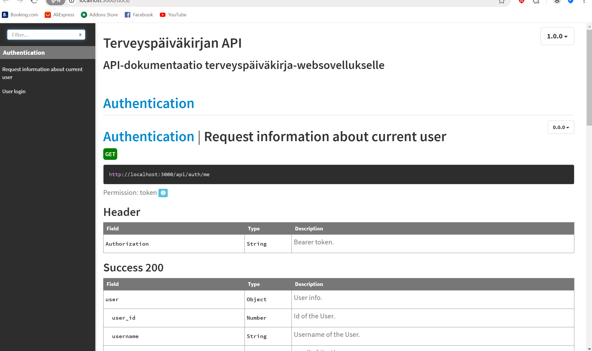

##  Kuvakaappaukset

### Kirjautumisnäkymä

### Etusivu

### Testisivu

### API-dokumentaatio
##  Kuvakaappaukset

### Kirjautumisnäkymä

### Etusivu

### Testisivu

### API-dokumentaatio
##  Kuvakaappaukset

### Kirjautumisnäkymä

### Etusivu

### Testisivu

### API-dokumentaatio
##  Kuvakaappaukset

### Kirjautumisnäkymä

### Etusivu

### Testisivu

### API-dokumentaatio
# Vite Front-end Projekti

Tämä on front-end-projekti, joka on kehitetty **Vite-kehyksellä**. Se sisältää modernin ja responsiivisen käyttöliittymän sekä API-yhteydet backendiin.

## Teknologiat
- HTML– Rakenne
- CSS – Tyylit
- JavaScript – Toiminnallisuus
- Vite– Nopeampi kehitysympäristö

## Linkit
- [Front-end repository](https://github.com/SaraHussaini/vite-yksil-projekti.git)
- [Back-end repository](https://github.com/SaraHussaini/backend-projekti)

## Ominaisuudet
- ✅ Käyttäjän kirjautuminen
- ✅ Responsiivinen käyttöliittymä
- ✅ Hakutoiminto
- ✅ API-yhteydet backendiin
- ✅ CRUD-toiminnallisuus (GET, POST, PUT, DELETE)

## Back-end ja API
- [API-dokumentaatio](http://localhost:3000/docs/)
